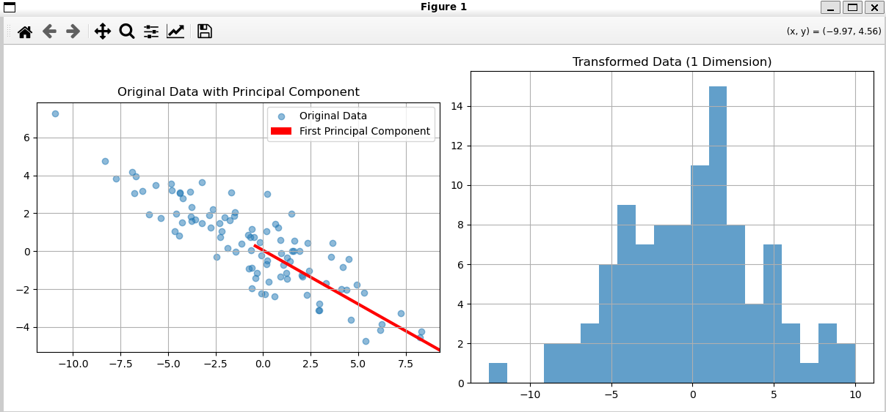

# 从零开始实现PCA (Principal Component Analysis)

## 1. 项目目标 (The "Why")

本项目旨在不依赖任何现成的机器学习库（如Scikit-learn），仅使用NumPy从零开始实现经典的降维算法——主成分分析（PCA）。

其核心学习目标有两个：
*   **深入理解PCA背后的数学原理**: 包括数据中心化、协方差矩阵、特征分解和数据投影。
*   **实践专业的机器学习工程范式**: 学习并应用Scikit-learn风格的`fit`/`transform` API接口设计，以及代码与测试分离的最佳实践。

## 2. 核心知识点 (The "What")

这个项目是我线性代数、NumPy编程和基础软件工程知识的第一次大统合。主要应用了以下关键知识点：

*   **数据中心化**: 在`fit`阶段，计算并存储训练数据的均值`self.mean_`。在`transform`阶段，使用**同一个**均值来中心化所有新数据，以保证变换的一致性。
*   **协方差矩阵**: 应用`np.cov(X, rowvar=False)`来计算中心化后数据的协方差矩阵。这是对数据分布形状的数学描述。 (详见`[我的协方差笔记](notion_link...)`)
*   **特征分解**: 应用`np.linalg.eig`对协方差矩阵进行特征分解。这是PCA算法的灵魂。
    *   **特征向量 (Eigenvectors)** 构成了数据方差最大的新坐标轴，即**主成分**。
    *   **特征值 (Eigenvalues)** 量化了数据在对应主成分方向上的方差大小。
*   **`fit`/`transform` API设计**: 将算法的“学习”过程 (`fit`) 和“应用”过程 (`transform`) 分离，这是专业机器学习库的通用设计模式，极大地提高了代码的复用性和灵活性。
*   **自动化测试**: 使用`pytest`编写独立的测试用例 (`test_pca.py`)，对`PCA`类的初始化、`fit`和`transform`方法的正确性进行自动化验证，确保了代码的健壮性。

## 3. 如何运行 (The "How")

本项目使用Conda进行环境管理。

1.  **克隆并进入项目**:
    ```bash
    git clone <your-repo-link>
    cd pca-from-scratch
    ```
2.  **创建并激活Conda环境**:
    (确保你已经创建了`environment.yml`文件)
    ```bash
    conda env create -f environment.yml
    conda activate pca_env
    ```
3.  **运行自动化测试**:
    ```bash
    pytest
    ```
    预期输出应为 `4 passed`。
4.  **运行可视化验证**:
    ```bash
    python test_pca.py
    ```
    将会显示一个包含原始数据分布和降维后结果的图表。

## 4. 最终成果 (The "Result")

通过`test_pca.py`中的可视化代码，我们可以清晰地看到PCA的效果。左图展示了原始的二维数据分布，以及我们算法找到的第一主成分方向（红色箭头），它完美地对齐了数据方差最大的“长轴”方向。右图展示了所有数据点被投影到这个一维主成分上之后的结果。



## 5. 反思与总结 (The "Lesson")

*   **最大的教训**: 在进行矩阵乘法时，**必须时刻关注矩阵的Shape**。最初在实现`transform`方法时，我错误地将投影计算写为`self.components_ @ X_centered`，导致了维度不匹配的错误。正确的投影应该是`X_centered @ self.components_`。这个错误让我深刻理解了数据点（行向量）与投影矩阵相乘的正确顺序。
*   **最重要的收获**: 理解了`fit`/`transform`范式的强大之处。通过在`fit`中“学习”并存储`mean_`和`components_`，`transform`方法变成了一个非常轻量、高效的函数，可以被重复应用于任何新的数据，而无需重新计算。这正是机器学习模型能够被“训练一次，到处使用”的核心思想。
*   **最实用的技巧**: `np.argsort()[::-1]`。通过获取排序后的索引，而不是直接对值进行排序，可以优雅地、同步地对特征值和特征向量进行配对排序，确保了它们之间的正确对应关系。